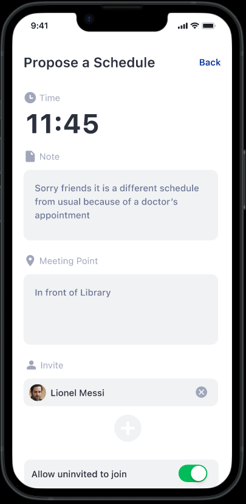

   &nbsp; &nbsp;
       

# LunchLink, Group 16

Andri Bernhardsgrütter, Charles Kremer, Nishanth Kumar, Alexander Schlieper, Alexander Staikov, Nicolas Stucki

## Needfinding

### Interview summaries

We conducted and summarized twelve needfinding interviews to gather information on how students and workers plan their lunches.

#### Interview 1

The student from the University of Zurich prefers lunch with a close-knit group, finding it a refreshing
break from studies. They frequent a nearby canteen due to convenience and communicate through
WhatsApp. Queueing time matters, but they're open to sharing their schedule online. Novelty and
canteen quality aren't major concerns. They're uncomfortable eating alone, highlighting social
pressure. Improved communication within friend groups is a need.

#### Interview 2

The intern values proximity, familiarity, and price for lunch. They appreciate a mix of familiar and new
faces. Novelty and venue changes are less crucial. They usually go at 11:30 without prior
communication, WhatsApp is used for rare plan adjustments. Eating alone provides downtime. They're
open to selective schedule sharing. They consider sharing availability with close coworkers first. Their
static work environment suggests less need for scheduling apps, but they could be beneficial in more
flexible situations.

#### Interview 3

A Mathematics student at ETH who frequently switches between three different groups of friends
based on his class schedule. The organization of these meetups usually takes place through WhatsApp,
with the same three individuals typically proposing the plans. More often than not, they choose to
dine at the university cafeteria. The interviewee tends to become nervous if the break exceeds one
hour. The group often goes for a walk during his lunch break.

#### Interview 4

Humanities student in London. The individual typically brings their own lunch, as cafeterias are not as
commonly used as they are in Zurich. This is particularly the case because students at that uni don't
usually spend their entire day on campus. The interviewee often has lunch with classmates who are in
the same course that takes place immediately before lunchtime. The timing of lunch can be quite
flexible.

#### Interview 5

This person is a caregiver and has school at BZZ. They have a very fixed schedule for lunch, which makes
it more important to have fast decisions and good planning. This person likes to go eat with the same
people, and prefers smaller groups.

#### Interview 6

This person works at Credit Suisse and studies IT at ZHAW on the side. This person prefers to with other
people, and likes big groups. This person does not mind if there are any other people joining, as long
as some of his good friends are there. For this person, it is important that they can find a place to eat
as fast as possible, and to be able to have nice long lunchbreaks.

#### Interview 7

They study VWL at Uni Zürich and consider lunch to be very important. They enjoy it most with good
people. They have no struggles with making lunch plans and always eats lunch with different people
depending on the weekday.

#### Interview 8

They study communication in the Masters and like to eat with 1-3 people. The price of the lunch is a
big factor. They usually make plans very spontaneously with eating and do not mind eating alone
sometimes but prefer to eat with people. Whether they eat with new people or people they know
does not matter as much.

#### Interview 9

The psychology student at the University of Zurich values familiarity in their lunch companions and
appreciates the availability of vegan options. Their lunchtime usually spans from 11:30 to 12:30. The
number of people and change of venue aren't major concerns. They use WhatsApp to organize lunch
plans. They're open to sharing their schedule via an app. Their primary need is to have lunch with a
consistent group of familiar faces. The insight gathered suggests that many prioritize familiarity for
comfort amid the demands of university life.

#### Interview 10

The ETH Master's student prioritizes familiarity in lunch companions and values the social aspect of
meals. They have a wide lunchtime window between 11:00 and 14:00, lasting 1 to 2 hours. The location
and novelty of venues aren't significant factors for them. They're comfortable with sharing their
schedule through an app. Their preference is for a relaxed, fixed group. The insight gained highlights
the importance of social connections during meals, providing a break from daily routines.

#### Interview 11

A student at ETH Zurich needs an all-in-one app for canteen menus, the ability to input a fixed time
and place for lunch, and suggestions for changing lunch time or canteen. So far, it has been a discord
group with which coordination has been done. Normal time tends to be at 13:00 since there is a
massive queue at 12:00.

#### Interview 12

They work in software engineering and want to discover new restaurants, find nearby lunch spots,
invite colleagues for lunch, and see food ratings. Insights include integration with maps,
personalization, and in-app ratings. They have a flexible lunch schedule.

#### Affinity diagram:

https://miro.com/app/board/uXjVNfhB-Wg=/?share_link_id=104881299540

## Desk Research

We researched 12 related works and have summarized the three most related or relevant ones here. You can find a full version of each 12 solutions in `Deliverables/week3`.

#### Lunchpool

Lunchpool kicked off as a startup idea back in 2019, aiming to help colleagues connect and network over lunch. We got in touch with CEO Alexander Abell and learned that due to the COVID-19 pandemic, they shifted their focus to virtual events. Nonetheless, the original idea provided us with some valuable insights.
Initially, the app was designed for in-company use. On Lunchpool, users set up profiles with info ranging from dietary needs to favorite movies. This setup encourages users to meet new people, as shared interests can break the ice and prevent any awkward silences. Users can let others know they're "down for lunch" and can then be invited by others or they can start their own lunch event that others can join. After connecting once you become “lunch buddies” for repeat lunch plans. It was also meant to integrate with common calendar apps and also provide you with restaurant recommendations.
We liked the user-friendly interface and functionality but were wondering at which point the profile with interests etc. becomes to complicated and closer to a full-fledged social media than a casual everyday lunch planner.

#### Group Chats

Group chats are the natural solution that almost every potential user is using to plan their lunches. They exist on every major messaging service like whatsapp, discord, etc. In these group chats of friends, one person proposes the time and everyone gives some kind of reaction to the plan to indicate if they will join or not. This is also the most flexible solution as no framework is imposed on how to plan the lunch and thus allows for any kind of irregularity. However, since group chats tend to be used for different reasons as well, the lunch messages can be lost in the amount of sent messages. The other problem is that a group chat is not always inclusive of every person joining the meal and thus don’t solve the problem in its most general form. We found that the messages exchanged in order to plan a lunch are often repetitive, thus indicated that there is an opportunity for optimisation. Below are a few screenshots of how these group chats might look like.

 

#### Lunchzeit

Lunchzeit, a German firm established in 2017 with a team of three professionals, focuses on fostering workplace connections and enhancing overall well-being. Their lunchlottery function is designed to facilitate diverse and engaging connections among employees. Their core philosophy is built upon the idea that fostering comfortable and connected employees leads to quantifiable benefits, such as reduced sick days, increased loyalty, and heightened productivity and creativity.

One notable aspect of Lunchzeit's approach is its adaptability. They tailor their matchmaking algorithm to meet the specific requirements of each partnering company, offering bespoke solutions. Whether it's the creation of a user-friendly web app or the seamless integration of their services into a company's intranet, Lunchzeit provides tailored solutions.

Furthermore, Lunchzeit offers its services at 49€ per month, presenting an affordable option for companies aiming to improve their corporate culture and boost employee morale.

This is something that could also be great for students, since feeling connected as a student and having people to ask questions can also improve a students grades and morale.
Thus it might be beneficial to try to connect people not only with their best friends for lunch, but maybe add other students from time to time.

## "How Might We" Statements

- How might we enable users to find a common lunchtime in a time-efficient manner?
  - How might we enable the user to show their friends when they are available for lunch?
  - How might we reduce the amount of work needed to plan lunch and remove repetitive actions?
  - How might we make the user feel at ease with sharing lunch with a less familiar person?
  - How might we allow users to set and modify standing arrangements easily?
- How might we enable the user to find the right size of groups?
  - How might we enable the user to have control over the group of people that join?
- How might we make sure that users actually commit to their proposed lunchtime?
  - How might we prompt users to keep their shared lunchtime slots updated?
  - How might we decide how to prioritize the different needs of the users? (Place, Time, Amount of people)
- How might we integrate in-app decision-making features for lunch plans?
- How might we enable the user to select a specific restaurant or provide his preferences?

## Brainstorming

We chose the brainstorming approach B, where we first had a 15min idea generation phase on Miro, an online whiteboard tool working marvellously for this job. Afterwards we used the feature to see who created which note in order to have every team member present their idea, making for a very productive discussion. While keeping our judgment towards ideas at a bare minimum, we still observed that mostly two different ways of solving the problem rose to the surface.

The first approach is more similar to Calendly. Each user enters their preferred time on a calendar and the app creates groups automatically that correspond to the respective friend groups.The second approach consists of users seeing the proposed times of their friends and being able to commit them. The difference basically boils down to who should be in charge of creating groups - the app or the users.

We also discussed the problem of users potentially not committing to their indicated schedule where we found a few interesting solutions.

Overall we are very happy with our brainstorming and the resulting Miro board from which we can draw inspiration in the future.

## Project description

    TODO

Introduction to chosen topic in own words, possibly with a brief motivation

## Ideation

    TODO

## Evaluation

    TODO

## Low-fidelity Prototype

#### Idea A

This version of the app illustrates the convenience of automated lunch scheduling for busy students. Without the hassle of daily planning, one receives timely notifications about lunch matches with friends based on the selected availability in the beginning of the week.

At the start of each week, you can select your desired lunch times and canteen for each day. You can do so by scrolling through a list of available times and selecting your preferred canteen from a dropdown menu. The app then pairs you with friends who have opted for the same time slot.  The final location is determined based on the majority vote.

You received a match for a lunch time and place with your friends and can either accept or reject the offer.

#### Idea B

This version of the app demonstrates the coordination of lunch plans amidst a hectic schedule. Bypassing the clutter of multiple chat groups, this version showcases the proposition and matching process. 

The home screen shows you an already proposed location and time including the people joining.  You can either press on the offer to join or press a button to propose another time.

Through this interface, you can suggest a time using a scrollable selector and choose a canteen from a dropdown menu. You can also designate the meeting point using the provided textbox and select the maximum number of friends joining via a dropdown menu.

#### Idea C

This version of the app showcases the process of confirming attendance for a lunch meeting initiated by another user.

## Mid-fidelity Prototype

#### Prototype 1: Manual Scheduling
 

 

This prototype solves the lunch scheduling problem day by day. You can commit to a time scheduled by your friends or you can also propose a time and invite them yourself. With easy login features, you can manage your circle by adding them to your friends list. Overall, this version of the app allows for flexible scheduling on a daily basis and facilitates last-minute plan changes. 

#### Prototype 2: Automatic Scheduling

 

 

This prototype handles the lunch scheduling problem in an automatic way. At the beginning of the week you pick your preferred lunch times for each day and either create or join a group of friends. The app will then automatically pick a time that suits each individual group member and propose it to the group. On each day you can then decide which group you would like to eat lunch with by accepting or declining the algorithm's proposed lunch time for each group. This scheduling manner allows for less last-minute flexibility, but it takes away the daily hassle of committing to and proposing lunch times. You simply set your preferences once a week and pick your preferred slot daily."

## Hi-fidelity Prototype

    TODO

## User study

    TODO
