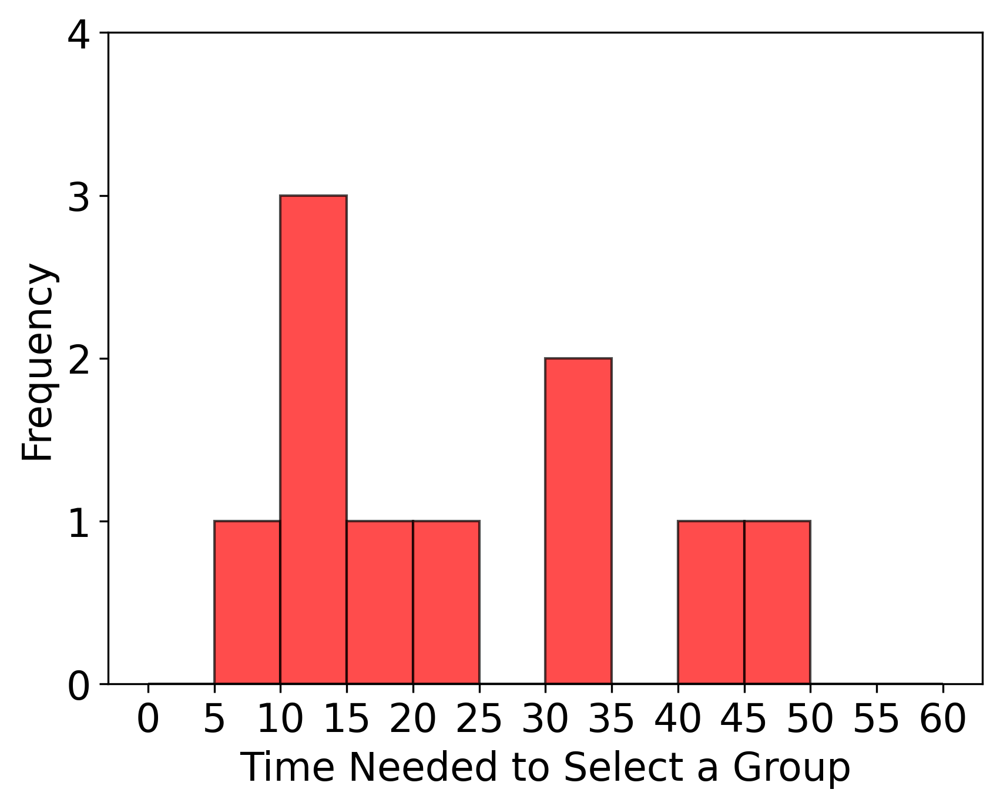
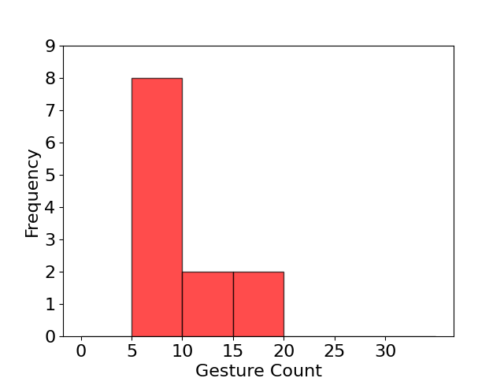

# Data Analysis Results
## Properties of Data
### Demographics

Average Age: 22.9

Median Age: 23.0

Average Tinder Familiarity: 2.6

Average Planning Frequency: 3.1

Average self-initiated lunch frequency: 2.8

### First Dependent Variable: SUS Values
NH1: The swiping feature instead of the button accept feature has no impact on the SUS value of the user.

#### Distribution of SUS Values in A Test
Result of Shapiro-Wilke Test A: p-value: 0.217

#### Distribution of SUS Values in B Test
Result of Shapiro-Wilke Test B: p-value: 0.576

#### Results of Levene Tests:

p val of Levene test for sus_a (started with A vs started with B): 0.795

p val of Levene test for sus_b (started with A vs started with B): 1.0

p val of Levene test for sus_a vs sus_b: 0.006

#### Result of Wilcoxon Signed Rank Test:

Z val of Wilcoxon Signed Rank Test on sus_a vs sus_b: 7.0

p val of Wilcoxon Test on sus_a vs sus_b: 0.009

#### Other Useful Metrics:

Average sus_a: 84.583 and standard deviation: 7.217

Average sus_b: 64.5 and standard deviation: 17.129

### Second Dependent Variable: Time Needed to Select a Group
NH2: The swiping feature instead of the button accept feature has no impact on the time needed to select a group.

#### Distribution of Time Needed to Select a Group in A Test

Result of Shapiro-Wilke Test A
p-value: 0.091
#### Distribution of Time Needed to Select a Group in B Test

Result of Shapiro-Wilke Test B
p-value: 0.329
#### Results of Levene Tests:

p val of Levene test for sus_a (started with A vs started with B): 0.013

p val of Levene test for sus_b (started with A vs started with B): 0.214

p val of Levene test for sus_a vs sus_b: 0.078

#### Result of Paired Students t-test:

DOF val of Paired Students t-test on time_a vs time_b: 0.825

p val of Paired Students t-test on time_a vs time_b: 0.427

#### Other Useful Metrics:

Average time_a: 39.75 and standard deviation: 30.317

Average time_b: 32.667 and standard deviation: 10.43

### Third Dependent Variable: Gesture Count
NH3: The swiping feature instead of the button accept feature has no impact on the amount of interactions (i.e., taps/swipes) the user has to do.

#### Distribution of Gesture Counts in A Test

Result of Shapiro-Wilke Test A
p-value: 0.022
#### Distribution of Gesture Counts in B Test

Result of Shapiro-Wilke Test B
p-value: 0.329
#### Results of Levene Tests:

p val of Levene test for gesture_count_a (started with A vs started with B): 0.31

p val of Levene test for gesture_count_b (started with A vs started with B): 0.694

p val of Levene test for gesture_count_a vs gesture_count_b: 0.093

#### Result of Paired Students t-test:

DOF val of Paired Students t-test on gesutre_count_a vs gesture_count_b: 2.002

p val of Paired Students t-test on gesture_count_a vs gesture_count_b: 0.071

#### Other Useful Metrics:

Average gesture_count_a: 28.583 and standard deviation: 20.002

Average gesture_count_b: 17.0 and standard deviation: 6.252

