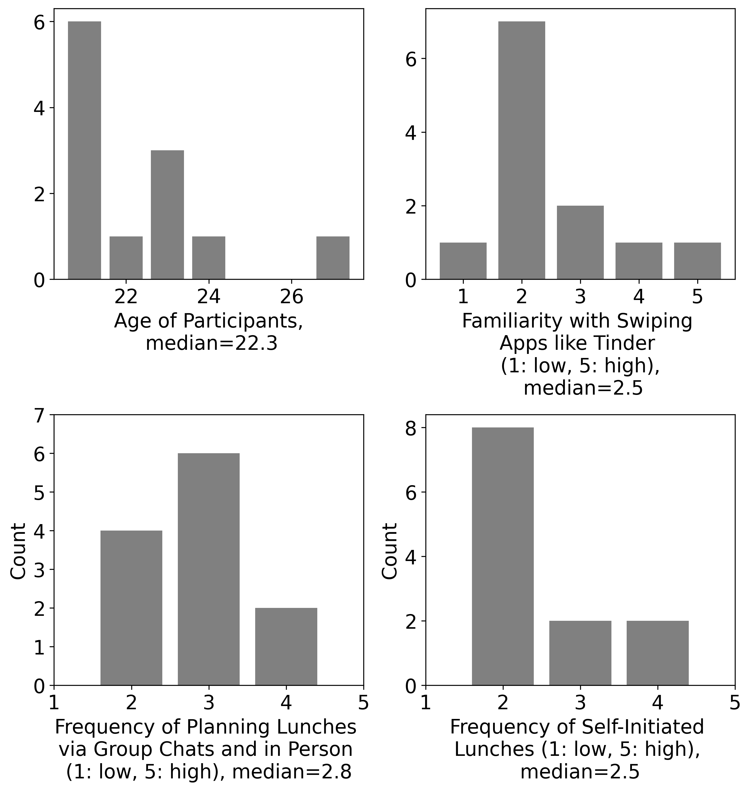

# Data Analysis Results
## Properties of Data
### Demographics

Average Age: 22.3

Median Age: 21.5

Average Tinder Familiarity: 2.5

Average Planning Frequency: 2.8

Average self-initiated lunch frequency: 2.5

### First Dependent Variable: SUS Values
NH1: The swiping feature instead of the button accept feature has no impact on the SUS value of the user.

#### Distribution of SUS Values in A Test
Result of Shapiro-Wilke Test A: p-value: 0.005

#### Distribution of SUS Values in B Test
Result of Shapiro-Wilke Test B: p-value: 0.021

#### Results of Levene Tests:

p val of Levene test for sus_a (started with A vs started with B): 0.843

p val of Levene test for sus_b (started with A vs started with B): 0.88

p val of Levene test for sus_a vs sus_b: 0.42

#### Result of Wilcoxon Signed Rank Test:

Z val of Wilcoxon Signed Rank Test on sus_a vs sus_b: 13.0

p val of Wilcoxon Test on sus_a vs sus_b: 0.136

#### Other Useful Metrics:

Average sus_a: 90.0 and standard deviation: 7.977

Average sus_b: 82.917 and standard deviation: 10.967

### Second Dependent Variable: Time Needed to Select a Group
NH2: The swiping feature instead of the button accept feature has no impact on the time needed to select a group.

#### Distribution of Time Needed to Select a Group in A Test

Result of Shapiro-Wilke Test A
p-value: 0.14
#### Distribution of Time Needed to Select a Group in B Test

Result of Shapiro-Wilke Test B
p-value: 0.121
#### Results of Levene Tests:

p val of Levene test for sus_a (started with A vs started with B): 0.02

p val of Levene test for sus_b (started with A vs started with B): 0.131

p val of Levene test for sus_a vs sus_b: 0.077

#### Result of Paired Students t-test:

DOF val of Paired Students t-test on time_a vs time_b: -1.755

p val of Paired Students t-test on time_a vs time_b: 0.107

#### Other Useful Metrics:

Average time_a: 22.333 and standard deviation: 12.745

Average time_b: 30.417 and standard deviation: 21.073

### Third Dependent Variable: Gesture Count
NH3: The swiping feature instead of the button accept feature has no impact on the amount of interactions (i.e., taps/swipes) the user has to do.

#### Distribution of Gesture Counts in A Test

Result of Shapiro-Wilke Test A
p-value: 0.334
#### Distribution of Gesture Counts in B Test

Result of Shapiro-Wilke Test B
p-value: 0.121
#### Results of Levene Tests:

p val of Levene test for gesture_count_a (started with A vs started with B): 0.069

p val of Levene test for gesture_count_b (started with A vs started with B): 0.005

p val of Levene test for gesture_count_a vs gesture_count_b: 0.577

#### Result of Paired Students t-test:

DOF val of paired t-test on gesutre_count_a vs gesture_count_b: 2.487

p val of paired t-test on gesture_count_a vs gesture_count_b: 0.03

#### Other Useful Metrics:

Average gesture_count_a: 13.417 and standard deviation: 5.775

Average gesture_count_b: 9.583 and standard deviation: 4.1

#### Means and Standard Deviations of the 3 Variables

